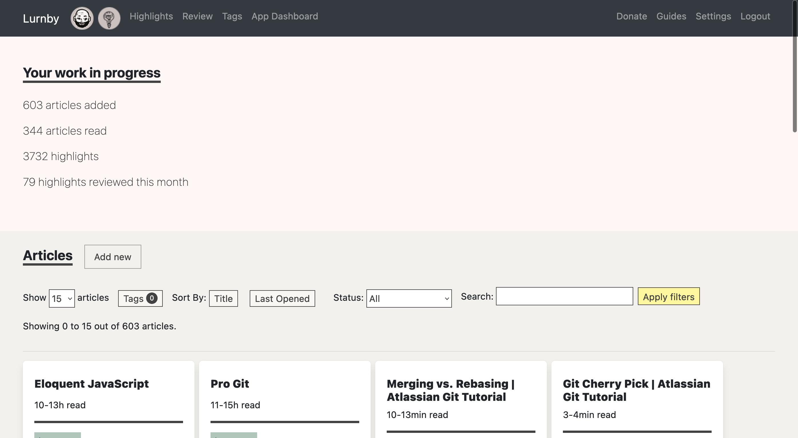
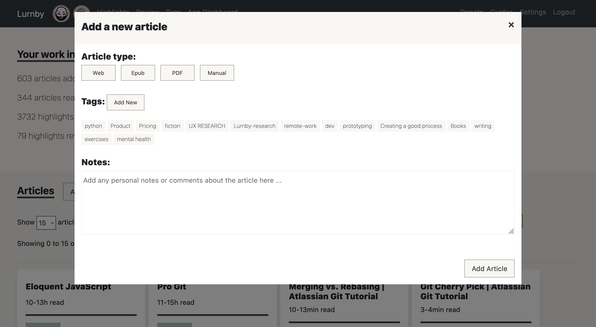
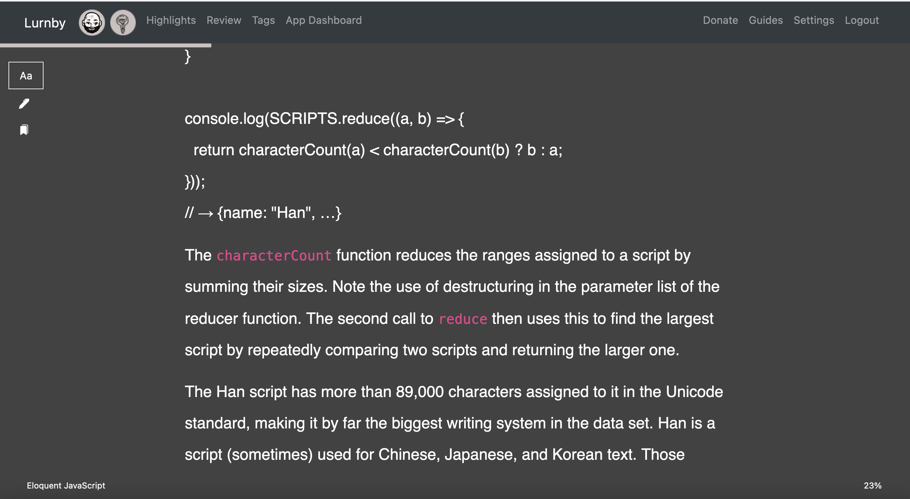
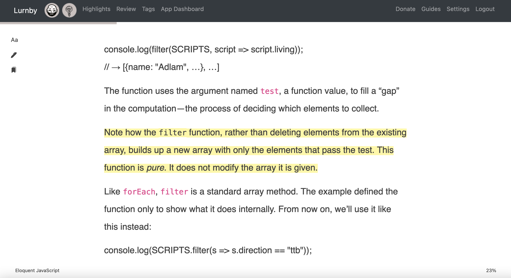
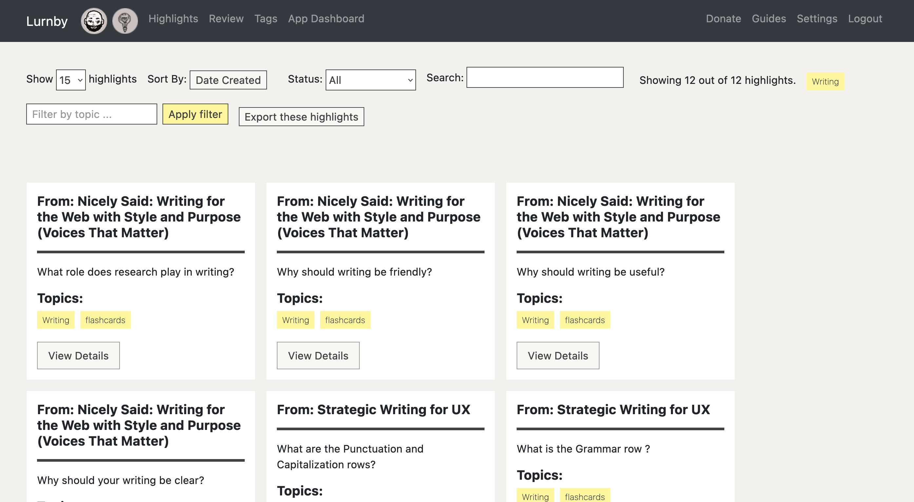
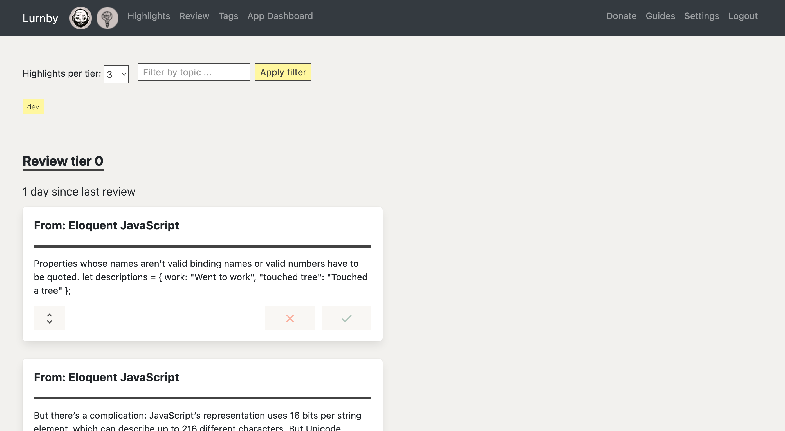

# Lurnby

A tool aimed at helping people learn better by allowing for more streamlined ways to interact with the material. 

At a basic level the tool is able to pull in content from the web and cleans it up to remove ads, scripts, and distracting materials. 

Then the tool helps you interact with the content by allowing you to create notes and highlights.

Highlights can be tagged for sorting, filtering, and review.  

Each note or highlight can then be filed away into a relational database with other such material. 

This allows you to start building themes and connections between the material you are reading, ultimately helping you create a latticework and structure on which new information can be added. 

At a very basic level, this process helps you remember more of what you read. 

The application has a built in review feature with a primitive spaced repetition algorithm.

## status
Currently works with epubs, blog posts, and emailed content. 

PDF parsing works, but is spotty. Notably graphs and tables, and other content doesn't load properly. So it isn't that good for medical articles and the like. 

Epubs are loaded as a single long file, so optimizations can be done on that front. 

## Screenshots

