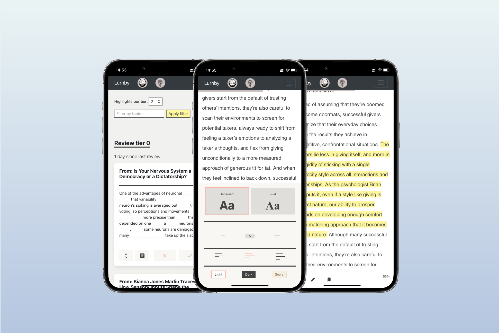

# Lurnby
A tool for building a personal knowledge practice. Lurnby helps you read and remember more. It works with web articles and epubs, allowing you to highlight, categorize, and review your content with active recall and spaced reptition tools. 

## Backend

## Frontend

## Screenshots

## Getting Started
Instructions for getting the app up and running are documented in the [Install.md](./install.md) script. 

## Contributing
Contributions are welcome. Features and issues are documented in the [github issues](https://github.com/Roznoshchik/Lurnby/issues) tab. Fork the repo and submit a pull request for review. 